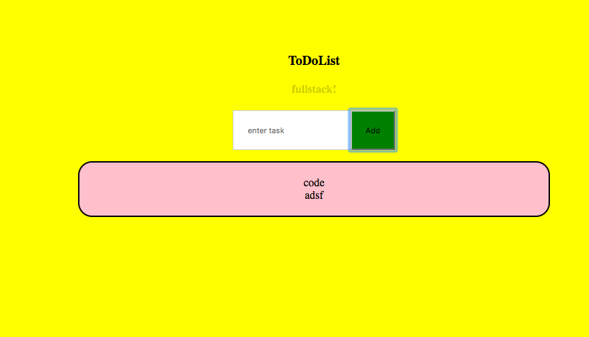

# react-webpack-babel-ToDoList
## June 28, 2017
### [David Eliason](http://www.deliason.com)
**What**
To-Do list using **react.js** using Components, state, nesting, forms

**Anything else?**
Yes, this app uses a dev environment for react.js using *babel*, *npm*, *webpack*.

[Return to Portfolio](https://davideliason.github.io/)

### To Use
1. Clone the repo
````
$ git clone https://github.com/davideliason/reactWebpackBabelToDoList
````
2. change into the new directory
````
$ cd reactWebpackBabelToDoList
````
3. invoke webpack to let Babel do it's JS translating-thing:
````
$ ./node_modules/.bin/webpack
````



[Return to Portfolio](https://davideliason.github.io/)
